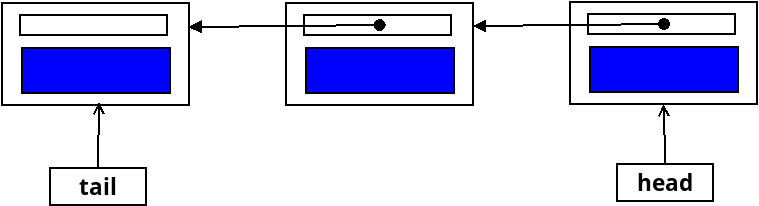
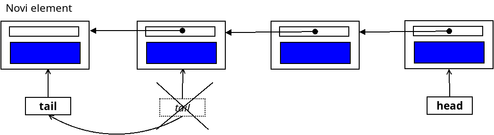
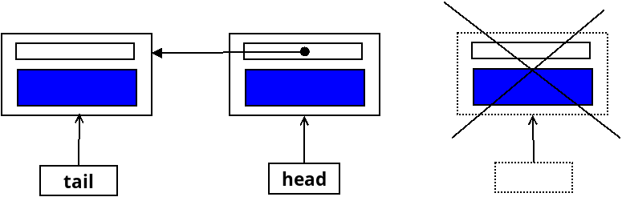
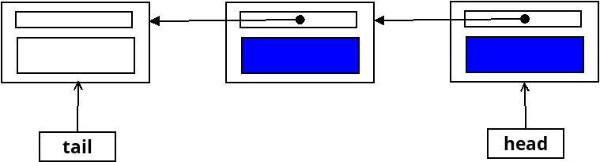
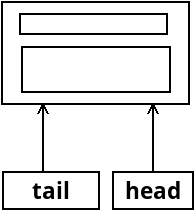

**Zadatak**. Konkurentni red s finom granulacijom zaključavanja.


 U redu koji smo konstruirali na predavanju koristili smo samo jedan mutex koji je osiguravao
 čitav red. Kako bismo povećali mogućnost paralelizma implementirati ćemo red sa dva mutexa. 
 Jedan će štititi početak, a drugi kraj reda. U tu svrhu moramo u potpunosti implementirati red 
 (bez korištenja reda iz standardne biblioteke) i to ćemo napraviti na bazi jednostruko povezane liste.
Red će stoga imati sljedeću strukturu:



 
Imat ćemo 2 pokazivača: `head` i `tail`. Jedan pokazuje na početak liste, a drugi na kraj liste.
Metoda `push()` će raditi na `tail` pokazivaču, a metoda `pop()` na `head` pokazivaču. 
Ovdje je idejno pokazano kako se ubacuje novi element u red metodom `push()`:




Ovdje je idejno pokazano kako se eliminira element s početka reda metodom `pop()`:



Kao i u prethodnom primjeru reda (napravljenom na predavanju) metoda `pop()` kombinira 
operacije `pop()` i `front()`, odnosno vraća element koji izbacuje iz reda. Jednako tako,
umjesto jedne metode  `pop()` imat ćemo blokirajuću i neblokirajuću verziju te metode. 

Svaki od dva pokazivača `head` i `tail`  bit će zaštićen svojim lokotom te je bitno da `push()` i `pop()`
metode nikada ne rade na istom pokazivaču jer bi tada trebale zaključati oba lokota, što komplicira 
implementaciju. U implementaciji ilustriranoj ovim slikama problem je prisutan u početnom trenutku 
(prazan red) kada je `head=tail=nullptr` te kada imamo samo jedan element pa je `head=tail` ili kada imamo dva 
elementa u redu, a jedan brišemo. 

Kako bismo  smanjili problem dvostrukog zaključavanja u povezanu listu ćemo uvesti 
jedan prazan element koji služi samo tome da odvoji `head` i `tail` pokazivače. Pokazivač `tail` će uvijek
pokazivati na taj prazan element. Ako prazan element označimo bijelom bojom, onda imamo sljedeću situaciju:



To je prihvatljivo jer pokazivač `tail` koristimo samo za ubacivanje novog elementa u red, a nikada za 
_čitanje_ čvora. Prazan red će imati samo prazan element i tada će biti `head=tail`:



Posljedica praznog elementa je a `push()` metoda dohvaća samo `tail` pokazivač. S druge strane, 
`pop()` metoda (odnosno `pop` metode) dohvaća oba pokazivača kako bi provjerila je li red prazan. 
Ako red nije prazan dalje radi samo na `head` pokazivaču. Zaključavaje `tail` pokazivača se dešava vrlo kratko tako da 
to ne predstavlja jako ograničenje na paralelizam. Treba paziti da se pokazivači zaključavaju 
uvijek u istom poretku kako bi se izbjegao _deadlock_. 

**Zadatak** je konstruirati konkurentni red sa sljedećim sučeljem:

```c++
template <typename T>
class Queue{
    struct Node{
        T  data;  
        Node * next;
    };
    mutable std::mutex head_mutex;
    Node * head;
    mutable std::mutex tail_mutex;
    Node * tail;
    std::condition_variable cv;
    
    public:
        Queue();
        ~Queue();

        Queue(Queue const &) = delete;
        Queue & operator=(Queue const &) = delete;

        bool try_pop(T &);
        void wait_pop(T &);
        void push(T);
        bool empty() const;
        void print();
};
```
Tu smo pored sučelja zadali bitne **implementacijske detalje**: `Node` je uobičajena struktura za čvor
povezane liste. Pokazivači `head` i `tail` se štite pomoću lokota `head_mutex` i `tail_mutex`. 
Pored toga koristimo uvjetnu varijablu. Kopiranje reda ne dozvoljavama te je od kontrole kopiranja 
potrebno napraviti samo dodijeljeni konstruktor i destruktor. 

**Sučelje**: Dvije su pop-metode: neblokirajuća `try_pop()` metoda i blokirajuća `wait_pop()` metoda. 
Kao i u redu s predavanja te metode kombiniraju `pop()` i `front()` metode i vraćaju vrijednost kroz argument metode. 

-  `bool try_pop(T &)` - Izbaci element iz reda i vrati vrijednost. Neblokirajuća verzija `pop()` metode; 
  vraća indikaciju je li uspjela učiniti operaciju. 
-  `void wait_pop(T &)` - Izbaci element iz reda i vrati vrijednost. Blokirajuća verzija `pop()` metode.
-  `void push(T)`      -  Ubaci element u red.
-  `bool empty() const` - vraća `true` ako je red prazan, inače `false`.
-  `void print()`       - Ispiši sadržaj reda. Služi samo za otkrivanje grešaka. 


**Ograničenja**. 

- Implementaciju metoda pisati u datoteku `tsqueue-fine-graded.h`. Sve metode implementirati izvan klase.
- Ne dodavati nove metode, niti u javnu niti u privatnu sekciju. 
- Testovi dani u `tests.cpp` moraju proći. U `main()` funkciji napisati vlastite testove. Obavezno imati barem 
jedan test s ispisom reda. 
